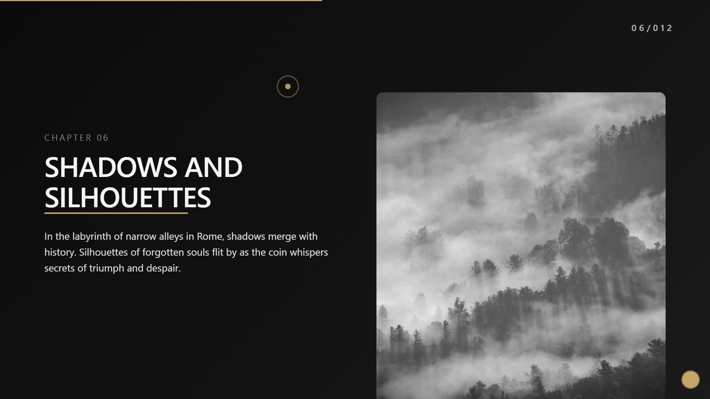

# Lost Coin Odyssey - Interactive Storytelling Website

[](LICENSE)

An immersive storytelling experience built with React, following the journey of a lost coin through life's adventures. Designed as an Awwwards-style website with smooth animations and cinematic effects.



## Features

- Parallax scroll effects
- Dynamic chapter transitions
- Responsive design
- WebP image optimization
- Custom scroll interactions
- Themed sections (light/dark)
- Performance-focused architecture

## Installation

1. Clone repository
```bash
git clone https://github.com/404CashNotFound/lost-coin-odyssey-react-template.git
```

2. Install dependencies
```bash
npm install
```

3. Start development server
```bash
npm run dev
```

## Customization Guide

### Modify Site Metadata (`index.html`)
```html
<!DOCTYPE html>
<html lang="en">
  <head>
    <meta charset="UTF-8" />
    <title>The Lost Coin Journey</title> <!-- Update title -->
    <meta name="description" content="An interactive story about loss and discovery"> <!-- SEO description -->
    <meta property="og:image" content="/assets/images/social-preview.jpg"> <!-- Social media preview -->
    
    <!-- Custom fonts -->
    <link href="https://fonts.googleapis.com/css2?family=Your+Custom+Font&display=swap" rel="stylesheet">
  </head>
</html>
```

### Edit Stories (`src/data/story.js`)
```javascript
export const chapters = [
  {
    title: "The First Loss",          // Chapter title
    content: `Barcelona, 1999...`,    // Story text (supports HTML)
    image: "/assets/images/ch1.webp", // Image path
    theme: "dark",                    // dark/light
    sound: "/assets/sounds/ch1.mp3"   // Optional audio
  },
  // Add new chapters below
  {
    title: "New Chapter Title",
    content: `Your story text...`,
    image: "/assets/images/new-image.webp",
    theme: "light"
  }
];
```

### Adding Images
1. Place images in `public/assets/images/`
2. Recommended specs:
   - WebP format
   - 1920x1080px minimum
   - Compressed (≤300KB)
3. Reference in story.js:
```javascript
image: "/assets/images/your-image.webp"
```

## Advanced Customization

### Theming
Modify CSS variables in `src/styles/_variables.scss`:
```scss
:root {
  --color-background: #0a0a0a;
  --color-text: #f5f5f5;
  --color-accent: #c5a769; // Gold accent color
  --font-primary: 'Playfair Display', serif;
}
```

### Animations
Adjust motion properties in `Chapter.jsx`:
```jsx
<motion.div
  initial={{ opacity: 0, y: 40 }}
  animate={{ opacity: 1, y: 0 }}
  transition={{ 
    duration: 1.2, 
    delay: index * 0.3 
  }}
>
```

### Add Components
1. Create new components in `src/components/`
2. Import in chapter files:
```jsx
import NewComponent from '@/components/NewComponent'
```

## Deployment
1. Build production version:
```bash
npm run build
```

2. Deploy `dist` folder to:
- Vercel
- Netlify
- GitHub Pages
- Firebase Hosting

## License
MIT © 2025 404CashNotFound

## Acknowledgments
- Built with [React](https://react.dev/)
- Animations powered by [Framer Motion](https://www.framer.com/motion/)
- Inspired by Awwwards-winning designs
```
